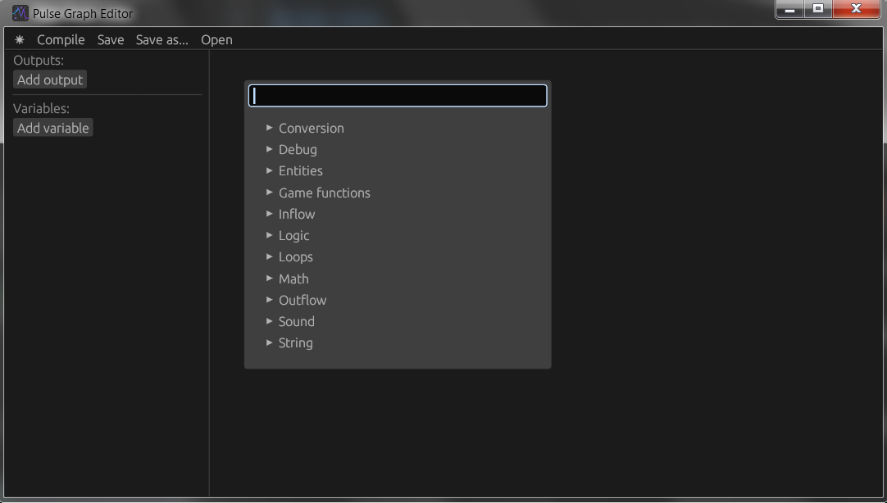
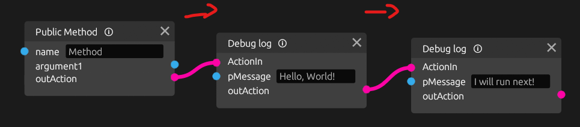
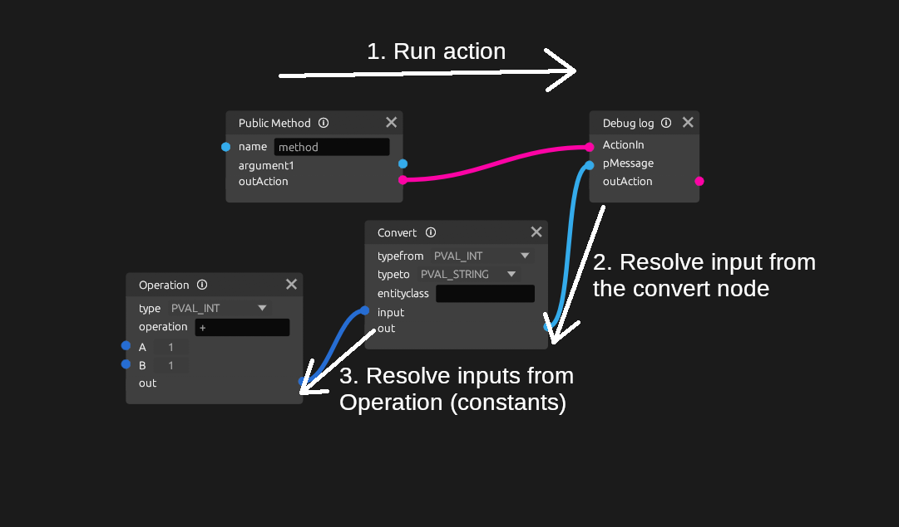
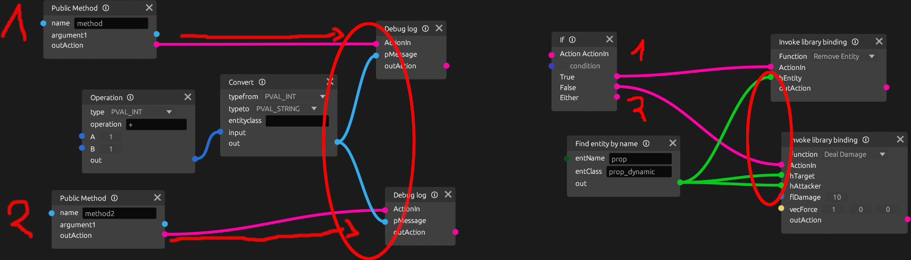

# An unofficial Pulse graph editor
"Pulse" is an in-development system for visual scripting in newer Source 2 engine games that is. Dota 2, CS2, and Deadlock right now.
There's no official tooling for creating these files, so this tool is supposed to serve as a temporary solution. As you will soon find out it's not perfect, and I didn't really intend it to be, as it's meant to be used as experimentation.

This tool is intended to work for Counter-Strike 2, as it's only really useful in this game currently.

## A few bits of important story...
The name in-development system suggets that it could still undergo changes wasting the effort of writing this app. The release of an official editor would also make this useless, so why bother spending time on it? Well, I like challenge and reverse engineering components of software, not only that, but I noticed that Pulse could do much more than any other possible scripting/map making methods. Granted, it still doesn't open up that much possibilities, but at least some more than was possible before, so this project is not totally useless! This project was also started as part of my Rust programming course at university, the only other ideas I had were one and done, so I decided to pick something not entirely useless, that I could also continue. So here we are! All of this was possible due to my weird obsessions.

## Game setup
Some initial setup inside the game files is required to make working with Pulse graphs way easier.

**NOTE:** These files don't interfer with VAC, it's possible to play normally with these modifications. Also, these modifications might disappear after game updates, and certainly will disappear when verifying game files!

### FGD setup
Go to `game/csgo/csgo.fgd` and add these lines, somewhere after all the imports and exports and all that..
```
@PointClass base(Targetname) tags( Logic ) iconsprite("editor/point_pulse.vmat") = point_pulse : "An entity that acts as a container for pulse graphs"
[
    graph_def(string) : "Graph path" : "" :
]
```
### assettypes setup
Go to `game/bin/assettypes_common.txt` and add these lines in between other asset definitons.
```
pulse_graph = 
{
    _class = "CResourceAssetTypeInfo"
    m_FriendlyName = "Pulse Graph"
    m_Ext = "vpulse"
    m_IconLg = "game:tools/images/assettypes/javascript_lg.png"
    m_IconSm = "game:tools/images/assettypes/javascript_sm.png"
    m_AdditionalExtensions = 
    [
        "pulse",
    ]
    m_CompilerIdentifier = "CompilePulseGraphDef"
    m_bContentFileIsText = false
    m_Blocks = 
    [
        {
            m_BlockID = "DATA"
            m_Encoding = "RESOURCE_ENCODING_KV3"
        },
    ]
}
```
This allows for Pulse graphs to be hot reloaded.

## App setup
Because of how this app is written, and my laziness, you will need python installed on your system in order to be able to compile graphs.

First download the build from releases, or build it yourself (rust, and cargo required)
If building yourself, you will also need to acquire [Source 2 asset assembler](https://github.com/LionDoge/source2-asset-assembler#Installation) python file.
You may possibly need to setup a venv with all the required dependencies. Lastly you need to adjust the `config.json` file approperiately
set `python_interpreter` to the python in the venv for asset assembler (or leave in the system-wide path). Set `assetassembler_path` to point to to the script file.

The release includes self-contained asset assembler script as a [pex](https://github.com/pex-tool/pex) file. If downloading from releases the only thing you need is python installed on the system, the default config should work fine.

Any yeah I know the setup is quite bad, but this may get changed. As I mentionted before, I didn't want to put too much effort in, it's supposed to work, not to be exactly the most optimal setup.

Once done you can just run the pulseedit executable. It is recommended to run it from the terminal in case any issues appear.

# Basic Usage
> ![NOTE]
> This section will see more additions as time goes on, and as possibly more questions appear.



On the right side there's the main viewport, right click to open the menu for adding new nodes. On the left side you can see list of variables you can add, while
the top bar allows you to open, save, and compile graphs. In order to compile a graph it needs to be saved first. Point it to the `game/csgo_addons/addonname/scripts` directory, or somewhere within your addon, that's where the compiled graphs will be saved.

## Basic logic flow
In order for graphs to be compilable it must have an entry point, which is a way of exposing the graph's functions to the game. You can find entry points in the 'Inflow' category. For example the 'Public Method' adds a custom entity input on the graph's entity, which can be triggered from a map.

Action nodes, for example EntFire, DebugLog and many others need their `ActionIn` parameter to be connected in order to run. Actions connected like that are ran sequentially, see example below:



One continous flow from one entry point is refered to as a 'Chunk'. It's good to remeber that for later!

## Using the graph in a map
First make sure you have saved the file inside the `game/csgo_addons/myaddon` directory, and that the graph is compiled (click 'Compile' in top left of the window). If no errors appear then the compile was succesful.

To your map add a `point_pulse` entity (make sure that FGD is setup properly!). Also make sure to give it a name for easier testing. The entity needs to be refered to the proper script path i.e. where the graph file is saved and compiled. The file path is relative to the current addon directory. If you have a pulse file in `game/csgo_addons/myaddon/scripts/graph.vpulse_c`. You need to input `scripts/graph.vpulse` in the 'Graph path' key.

Now compile the map. If you replicated the example pictured above, you should be able to use `ent_fire point_pulse_name Method` to run the method. You should see a console output from the debug logs. You can now modify the graph further and apply the changes instantly by clicking 'Compile'. The game will reload the graph automatically introducing new changes.

## Value nodes
Not all nodes are action nodes, some just provide values to feed in the input ports and are resolved before the action they're connected to is ran. There are many utility nodes, including ones that grab data from the game, or do operations on values. Refer to the image below for a visual explaination.



This was a basic explaination on how the graphs are processed. Take a look at examples in the 'examples' directory. You can also hover over the information sign on added nodes in the app to display their usage notes.

## What to avoid
There are some caveats due to how this tool was made. It's not perfect, and there are some situations that are unchecked but are invalid. Refer to the image below.

**Don't connect outputs from the same node between different chunk, or during a split of a conditional (like an if condition). These nodes are processed and then reused, but not every situation is checked, and instead of the nodes being recomputed for each chunk or conditional split, they're reused, resulting in incorrect logic.** If in doubt just make a new node. Refer to the example below for such **invalid** uses.


# Examples
Examples can be found in the 'examples' directory.

- `inputs` basic introduction to using public methods 
    - 'RunMe' method for a very basic print
    - 'DebugText string' method that accepts a string argument for what to display on a entity named 'dynprop' that is a *prop_dynamic* (needs to be setup properly in Hammer.)
    - 'OnRoundStart' event that prints the current round number to the console when a new round starts.

- `entities` Shows basic interaction with entities: Entity handles, and using EntFire.
    - 'GetHeightAboveWorld' will print height above the world of a entity named 'btn' that is a *func_button*
    - 'ReColor entity_name' will tint all entities to red that are named same as the provided argument.

- `forloop` Shows an example of a nested indexed loop

- `entities2` is a more complex example of finding all entities by a classname. It uses the *Find entities within* node, and a while loop. Each iteration a found entity is saved into a variable and then fed back as the starting entity for the node to find another entity, till all entities are exhausted. In this case the distance between each *decoy_projectile* and a prop named 'src' of *prop_dynamic* will be shown above each decoy when the method 'DisplayDistance' is ran.

- `timing` shows some examples of delaying exeuction

- `remote_nodes_listen_entity_output` Shows examples of so called 'remote nodes' that can be reused. Think like a function in a programming language. It also shows an example of listening to an output from an entity and using the activator handle. In this scenario pressing a *func_button* named `btn` will deal 10 damage to the activator.

- `radio` Is an example of a 'radio' that can switch between different music with the 'NextSong' method, it also demonstrates how to play sounds, and change their parameters while they're playing. In this 'VolumeUp' and 'VolumeDown' inputs can be used to adjust the volume of a playing song. This is also a good demonstration of how to use operations and conditional checks.